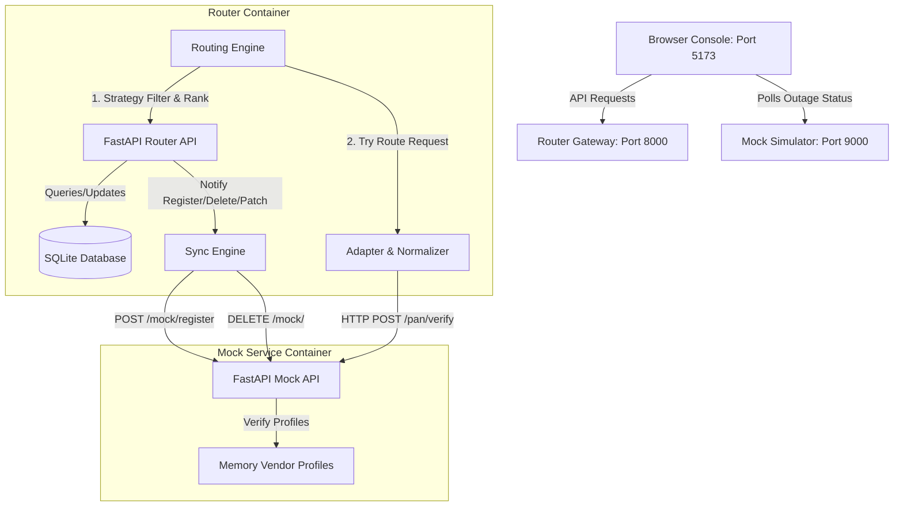

# 🚀 Intelligent Vendor Routing Platform

An intelligent, enterprise-grade vendor routing gateway and real-time observability control room console. Built with a high-performance **FastAPI** backend, **SQLite** database registry, **React + TypeScript** console, and an autonomous **Agentic AI Copilot** sidecar.

The platform provides a unified API interface that dynamically handles routing rules, out-of-band updates, active failover chains, rate-limit exclusions, and circuit-breaker states across simulated upstream provider APIs (e.g. PAN Verification, OCR, SMS).

---

## 📐 System Architecture

Below is the network topology of the platform under Docker Compose:



---

## 🛠️ Key Capabilities & Features

1. **Robust Routing Core (8 Strategies)**:
   - `priority`: Absolute strict ordering (always selects the lowest-number priority).
   - `weighted`: Distributes transactions probabilistically based on assigned relative percentage weights.
   - `lowest_latency`: Selects the provider with the lowest dynamic response latency in the sliding window.
   - `lowest_cost`: Selects the cheapest provider supporting the requested capability.
   - `failover`: Sequences through candidates until one succeeds, automatically trying alternative nodes.
   - `round_robin`: Rotates systematically through the set of enabled providers.
   - `feature_based`: Filter candidates by specific criteria (e.g. `dobMatch`, `nameMatch`) before applying strategy rules.
   - `health_based`: Dynamically drops degraded vendors and shifts load to healthy nodes.
2. **Outage Simulation & Sandbox**:
   - Outage switches let you simulate a down node instantly.
   - Sliders let you inject high response times (latencies) and jitter to trigger circuit breakers dynamically.
3. **Automated Gateway-to-Mock Sync Engine**:
   - **Lifespan Startup Sync**: On backend boot, the gateway queries SQLite and dynamically registers active vendor configurations with the mock service.
   - **Real-time Mutation Hooks**: Registering, deleting, or editing vendor parameters on the UI issues out-of-band HTTP updates to the mock service simulator automatically.
4. **Sleek Observability UI**: Built with a cyberpunk telemetry aesthetic, displaying latency sparklines, success rates, real-time timelines, decision logs, and an **AI Copilot** console.
5. **LLM Sidecar**: Powered by Claude 3.5 Sonnet to translate natural language into routing configs, analyze system telemetry anomalies, and explain decision logs.

---

## 🚀 Quick Start (Docker Compose Mode)

The entire system is containerized and can be booted in seconds. Ensure Docker Desktop is running.


### 1. Boot the Containers
```bash
docker compose up --build
```

### 2. Ports & Service Access
Once the containers are healthy, open these URLs in your browser:
* **Frontend Console**: [http://localhost:5173](http://localhost:5173)
* **Router Gateway API Docs**: [http://localhost:8000/docs](http://localhost:8000/docs)
* **Mock Service Outages**: [http://localhost:9000/mock/status](http://localhost:9000/mock/status)

---

## 💻 Local Development (Host Mode)

If you wish to run the backend and frontend directly on your host machine for development:

### 1. Run the Mock Provider Simulator
Exposes the mock providers on port `9000`:
```bash
cd mock-vendors
python3 -m venv .venv
source .venv/bin/activate
pip install fastapi "uvicorn[standard]" 
uvicorn app:app --port 9000 --reload
```

### 2. Run the Gateway Router
Exposes the SQLite registry, routing core, and API logs on port `8000`:
```bash
cd router
python3 -m venv .venv
source .venv/bin/activate
pip install -e ".[dev]"
uvicorn app.main:app --port 8000 --reload
```

### 3. Run the React Console
Spins up Vite dev server on port `5173` (or fallback `5174` if occupied):
```bash
cd frontend
npm install
npm run dev
```

---

## 📖 API Reference Guide

### 1. Core Route Transactions
* **Endpoint**: `POST /route`
* **Body**:
```json
{
  "transactionId": "tx-98231",
  "capability": "PAN_VERIFICATION",
  "strategy": "priority",
  "features": ["nameMatch"],
  "payload": {
    "pan": "ABCDE1234F",
    "name": "Aayush Soni"
  }
}
```
* **Response**:
```json
{
  "transactionId": "tx-98231",
  "status": "SUCCESS",
  "routedTo": "VendorA",
  "latencyMs": 420,
  "cost": 1.5,
  "response": {
    "verified": true,
    "matchScore": 100
  },
  "attempts": [
    {
      "vendor": "VendorA",
      "status": "SUCCESS",
      "latencyMs": 420,
      "code": 200
    }
  ]
}
```

### 2. Manage Registry Providers
* **Register a Vendor**: `POST /vendors`
```json
{
  "name": "VendorD",
  "capability": "PAN_VERIFICATION",
  "baseUrl": "http://mock-vendors:9000",
  "priority": 3,
  "weight": 50,
  "costPerRequest": 1.0,
  "timeoutMs": 2000,
  "rateLimitPerMinute": 100,
  "supportedFeatures": ["nameMatch"],
  "enabled": true
}
```
* **Edit Vendor Parameters**: `PATCH /vendors/{name}`
```json
{
  "priority": 1,
  "weight": 75,
  "costPerRequest": 0.8
}
```
* **Delete a Vendor**: `DELETE /vendors/{name}`
* **Fetch Registered List**: `GET /vendors`

### 3. System Observability Logs & Metrics
* **Logs List**: `GET /routing-logs?page=1` (returns paginated routing traces and attempt chains).
* **Live Telemetry metrics**: `GET /vendor-metrics` (returns sliding window latency averages, error rates, and circuit-breaker states).

---

## 🧪 Automated Testing

We maintain a comprehensive suite of E2E verification tests checking:
* Dynamic client headers and payload parsing.
* Sliding-window latency calculators and Circuit Breakers.
* Token-bucket rate-limiters.
* Fallback attempt loops.

To execute tests locally:
```bash
cd router
source .venv/bin/activate
pytest -v
```

---

## Walkthrough

Run through this script to showcase the core architectural features step-by-step:

### Step 1: Show Dynamic Configuration Sync
1. Open the **Upstream Providers** page in the console.
2. Click **Add Provider** and register a new vendor named **`VendorTest`** with:
   * Timeout: `1500ms`, Cost: `₹0.50`, Priority: `5`, Features: `nameMatch`.
3. Open a second browser tab to `http://localhost:9000/mock/status`.
4. Point out that **`VendorTest`** was dynamically added to the mock service's in-memory status instantly without restarting any container or service!

### Step 2: Show Automatic Failover (Resilience)
1. Open the **Gateway Sandbox** tab.
2. Under "Test Routing Engine", execute a PAN verification request with `strategy: "priority"`.
3. Point out that **`VendorA`** served the request (it has Priority `1`).
4. Now, scroll to **Live Outage Simulator** at the bottom, and click **Force Outage** for **`VendorA`** (turns red).
5. Trigger the routing request again.
6. **The Result**: The transaction still returns `SUCCESS`! Show the interviewer the **Timeline** chart. Point out how the routing pipeline attempted `VendorA`, hit a failure/timeout, and seamlessly failed over to `VendorB` on the fly!

### Step 3: Show Circuit-Breaker Tripping
1. Keep **`VendorA`** in an outage state.
2. Send 5 consecutive requests using the Sandbox.
3. Show the **Telemetry Matrix** success rates. 
4. Explain how the sliding-window metrics detected 5 sequential strikes, automatically tripped **`VendorA`**'s Circuit Breaker state to **`OPEN`**, and fast-failed future routes directly without making network requests to save system resources.

---

## 🆘 Troubleshooting

### 1. `FileNotFoundError: [Errno 2] No such file or directory` or `process.cwd failed`
* **Why**: This occurs if you modified local source code or ran a Git command that modified folder inodes while uvicorn or npm watch processes were active.
* **Fix**: Reset the terminal directory context by running `cd` into the folders again and restarting the server commands:
  ```bash
  # For Router:
  cd router && source .venv/bin/activate && uvicorn app.main:app --port 8000 --reload
  # For Frontend:
  cd frontend && npm run dev
  # For Docker Compose:
  docker compose down && docker compose up --build
  ```

### 2. Frontend loads but console says "Failed to fetch vendors"
* **Why**: The frontend is trying to call the backend gateway on `http://localhost:8000` but the backend router server is either stopped or blocked.
* **Fix**: Ensure your router server is up and listening on port `8000` or inspect the uvicorn terminal.
