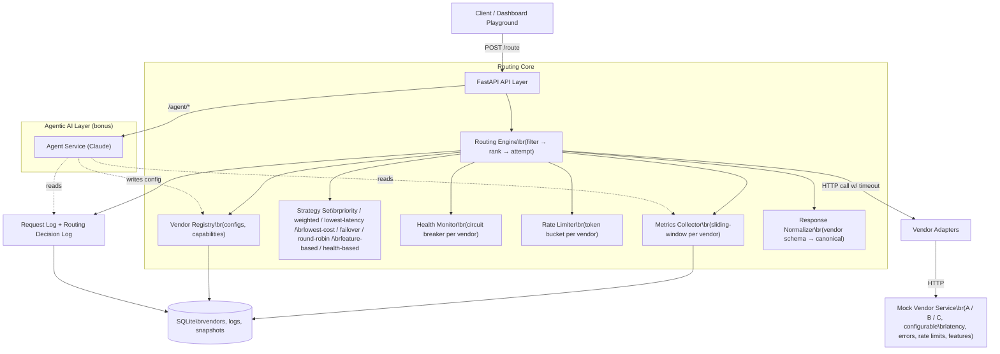

# System Architecture Blueprint

This document details the software architecture, request lifecycles, and component designs of the Intelligent Vendor Routing Platform.

## 1. Flow Diagram

## 2. Key Component Specifications

### 2.1 The Routing Pipeline (Filter → Rank → Attempt)
Every `/route` transaction runs through three distinct phases:
1. **Filter (Eligibility)**: Excludes vendors that are disabled, lack requested features, have tripped circuit breakers, are rate-limited, or exceed `maxLatencyMs` thresholds.
2. **Rank (Sort)**: Sorts remaining eligible providers using one of 8 strategy algorithms (Nginx-style smooth weighted round-robin, ascending priority, health composite scoring, lowest cost, lowest latency, etc.).
3. **Attempt (Failover Exec)**: Sequentially contacts providers in sorted order. If a provider times out or returns a non-2xx status (e.g. 5xx or rate limit 429), it records the failure, updates health metrics (tripping circuits if necessary), and seamlessly attempts the next candidate.

### 2.2 Circuit Breaker Health Machine
Per-provider circuit state transitions:
- **CLOSED**: Normal state. Requests flow through. Trips to `OPEN` if consecutive failures $\ge 5$ or error rate $\ge 50\%$.
- **OPEN**: Rejected immediately in filter stage. Automatically transitions to `HALF_OPEN` after 30 seconds.
- **HALF_OPEN**: Allows a single trial request. Success resets to `CLOSED`, while failure trips back to `OPEN`.

### 2.3 Rate Limiter Token Bucket
An independent token bucket is initialized for each vendor:
- Capacity is set to the vendor's `rateLimitPerMinute` config.
- Refills continuously at `capacity / 60` tokens per second.
- Protects downstream APIs from overloading and enables preemptive failover.
